= Caffeinated AFTONSPARV

This small PCB replaces the original board inside your https://www.ikea.com/us/en/p/aftonsparv-led-decorative-light-planet-shape-multicolor-20559209/[AFTONSPARV Planet lamp].
It connects to your smart home setup via a common ESP32 firmware like https://esphome.io[esphome.io] or https://kno.wled.ge[WLED].

And the best thing, it's all OSHW certified: https://certification.oshwa.org/de000140.html[DE000140]

[#img-OSHW-DE000140,link=https://certification.oshwa.org/de000140.html]
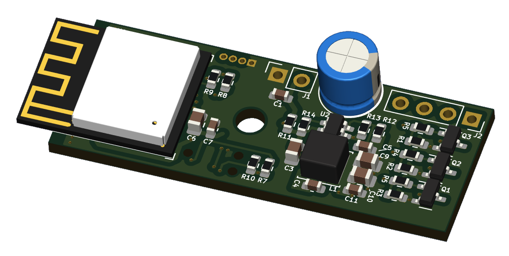 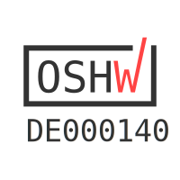
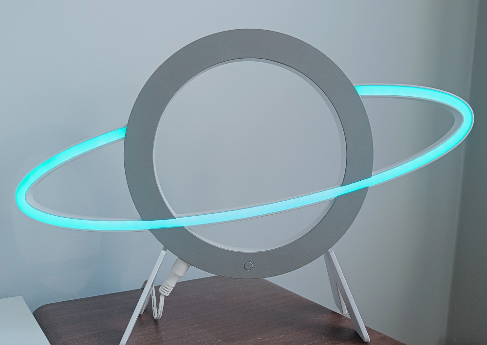

== Instructions

=== Step 1: Remove the cover
Remove the bottom cover from the AFTONSPARV lamp, there is no need to open the top cover. Open the marked screws, there's one under the sticker.

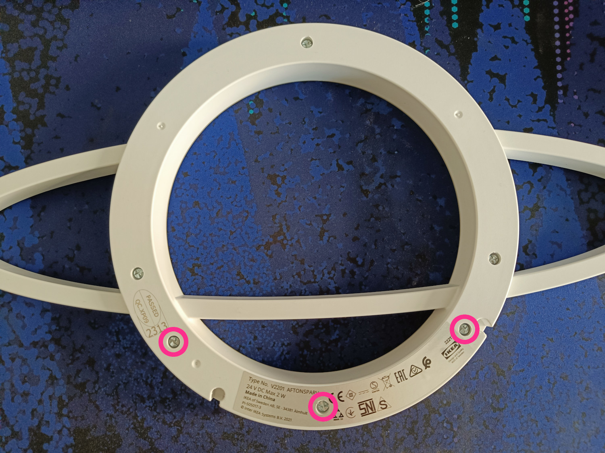

=== Step 2: Disconnect the wires
Carefully de-solder all wires from the old board, it is not needed anymore.

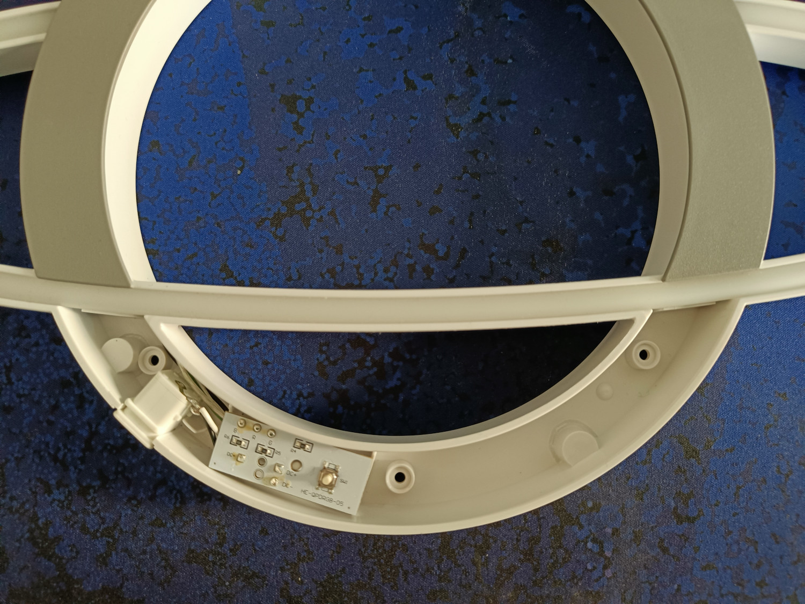

=== Step 3: Connect the PCB
Carefully solder the wires to the Caffeinated AFTONSPARV as shown below:

|===
| IKEA Lamp | PCB

|LED, black | LED R
|LED, green | LED G
|LED, transparent | LED B
|LED, white | LED {plus}

|Plug, white | POWER {plus}
|Plug, black | POWER -
|===
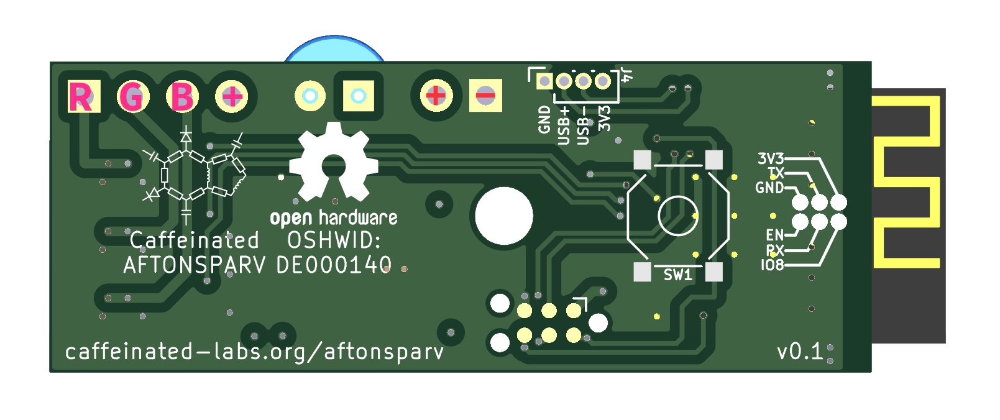
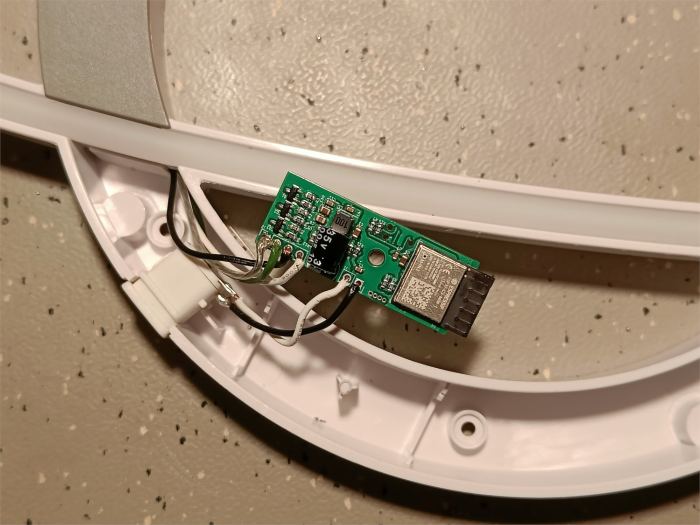

See <<PinOut>> for more details

=== Step 4: Test
Connect the power and test the PCB.
If nothing gets hot, you can measure 3.3V at the USB Port continue with the firmware installation

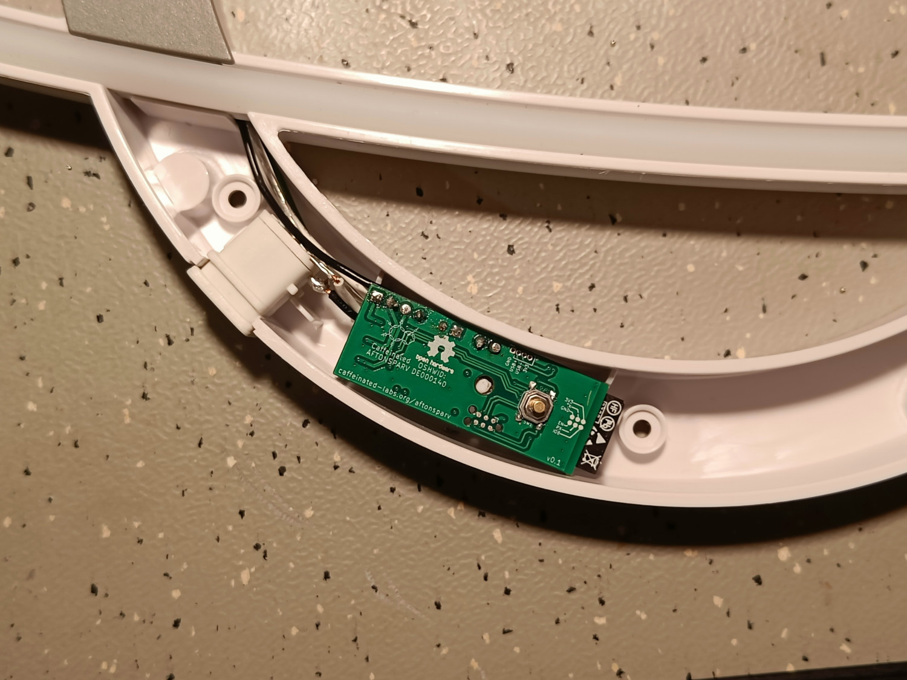

=== Step 5: Install firmware
Connect the ESP to your computer using the TagConnect or USB interface and install the firmware of your choosing. The button on the front is connected to `IO9`, the boot-mode selectorfootnote:boot-mode[https://www.espressif.com/sites/default/files/documentation/esp32-c3-mini-1_datasheet_en.pdf#table.4].

IMPORTANT: The board *must* be powered with 24V to install firmware.

See <<Firmware>> and <<PinOut>> for more details

=== Step 6: Close it up
Carefully screw-on the cover and enjoy your new and _caffeinated_ lamp.

== PinOut

=== UART
NOTE: The diagram on the PCB v0.1 shows `IO8` - it is connected to `IO9`!

To upload software you can use the standard workflow using `esptool.py` footnote:esptool[https://docs.espressif.com/projects/esptool/en/latest/esp32/] just like any other ESP32 board. The UART interface is exposed on the TagConnect port:

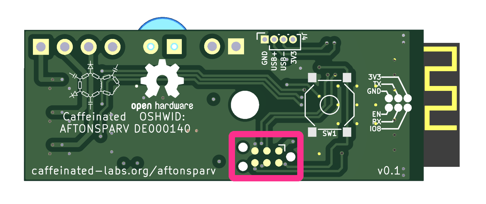 

=== USB
In addition, the USB interface is exposed as well. It is located on the edge next to the 24V input. Please remember that the ESP32 uses 3.3V and *not* the usual 5V.

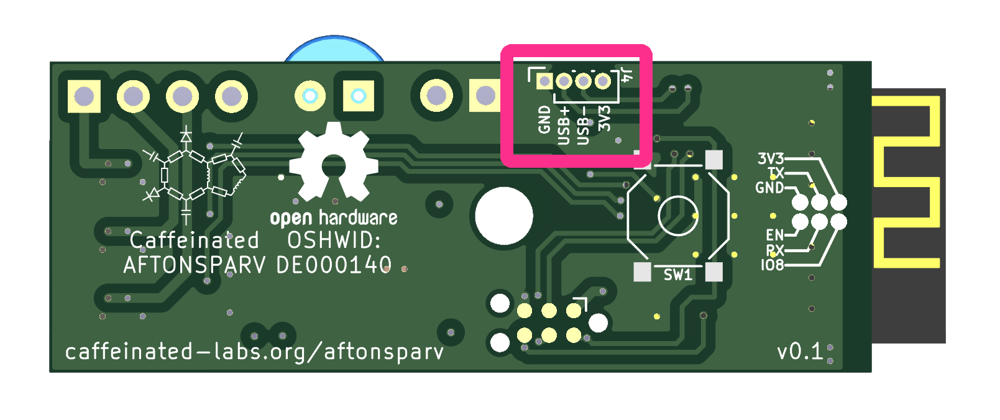

=== Boot Mode
The front button as well as the <<UART>> interface is connected to `IO9`, which is the boot mode selector (on older models `IO0`) on this ESP32footnote:boot-mode[]. Pressing the button or connecting it to ground puts the ESP into _Download Boot_ mode. Now you can install firmware via <<UART>> or <<USB>>

=== Power & LED
NOTE: On v0.1 the LEDs and Power connections are not labeled on the silkscreen.

Connect the AFTONSPARVs LEDs to the left ports as shown and the power input to the right most *big* connections, connecting to the USB Port will destroy the ESP.

== Firmware
=== WLED
==== Installation
[%hardbreaks]
Installing the WLED firmware is easies with their web installer: https://install.wled.me/[install.wled.me]
When installing with `esptool` footnote:esptool[] follow this guide and use the ESP32-C3 binary: https://kno.wled.ge/basics/install-binary/[kno.wled.ge/basics/install-binary]
**Important:** Install this https://install.wled.me/bin/release_0_14_0/esp32-c3_bootloader_v2.bin[ESP32-C3 bootloader] *not* the ESP32 bootlader.

==== Configuration
[%hardbreaks]
LED Preferences > Hardware setup
*1*: `PWM RGB`
*Index*: `0`
*GPIOs*: `5`, `6`, `7`

*Button 0 GPIO*: `9`, `Pushbutton`

.Show screenshot
[%collapsible]
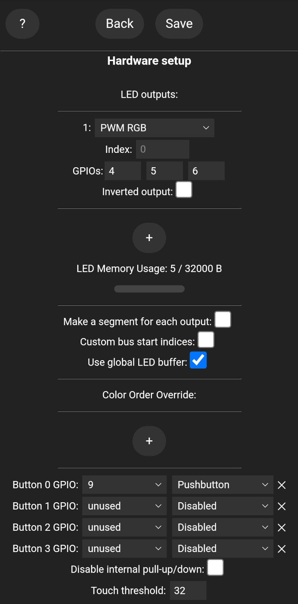

== Hardware

IMPORTANT: It is not possible to hand-solder this project, it requires a hot-air station or reflow oven. It is recommended to use a stencil for solder paste.

=== BOM

|===
| Reference         | Value                  | Qty | LCSC

|C1, C4, C7, C11    | 100nF                  | 4   | C14663
|C2                 | 100µF 35V              | 1   | C2831717
|C3, C6, C9, C10    | 4.7uF                  | 4   | C560882
|C5                 | 22pF                   | 1   | C105620
|L1                 | 10uH                   | 1   | C38117
|Q1-Q3              | AO3400A                | 3   | C347475
|R1-R3, R7-R10, R14 | 10kΩ                   | 8   | C98220
|R4-R6              | 20Ω                    | 3   | C22950
|R11                | 1Ω                     | 1   | C22936
|R12                | 100kΩ                  | 1   | C25803
|R13                | 22.1kΩ                 | 1   | C25961
|SW1                | SW_Push                | 1   | C2910751
|U1                 | ESP32-C3-MINI-1-[H/N]4 | 1   | C2934569 / C2838502
|U2                 | SY8201ABC              | 1   | C108052
|===

link:bom/ibom.html[BOM Tool]